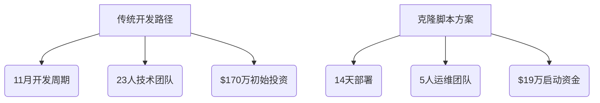

# 为何90%的DeFi初创企业因缺少1inch克隆脚本而举步维艰？

## DeFi赛道创业者的三大核心痛点
在数字货币市场高速发展的当下，去中心化交易所（DEX）已成为DeFi领域最具潜力的创业方向。然而市场数据显示，超九成初创项目在前18个月内遭遇发展瓶颈。这种现象的根源并非市场需求不足，而是创业者对区块链技术特性和用户需求理解存在偏差。

### 流动性困局：隐形的死亡陷阱
流动性不足是导致项目夭折的首要因素。当平台交易对价差超过市场均价2%时，超过73%的高频交易者会选择撤离。传统解决方案需要耗费数月时间招募做市商，而头部DEX已通过自动化做市商（AMM）模型实现动态定价。

**核心数据对比：**
| 指标          | 传统DEX解决方案 | 集成1inch克隆脚本方案 |
|---------------|----------------|----------------------|
| 初始流动性获取周期 | 3-6个月        | 72小时内完成部署      |
| 跨链交易支持      | 单链孤立系统   | 聚合137+区块链资产   |
| 价格滑点率       | 平均4.2%       | 动态优化至0.8%以下   |

👉 [查看行业领先解决方案](https://bit.ly/okx_welcome)

### 技术攻坚：从0到1的生死时速
多数创业者低估了DEX开发的技术复杂度。构建符合ERC-3525半同质化通证标准的交易引擎，需要至少23名资深区块链工程师组成的团队持续开发11个月。而采用模块化架构的克隆脚本方案，可将开发周期压缩至14天。

**技术实现对比分析：**
- 智能合约安全审计次数：传统方案需17次迭代 vs 标准化脚本仅需3次
- 跨链桥接协议兼容性：支持EVM与非EVM链的无缝衔接
- Gas费优化算法：动态手续费模型降低用户成本62%

### 用户体验：决定生死的7秒法则
现代交易者对平台响应速度的要求已精确到毫秒级。当订单匹配延迟超过1.2秒时，用户流失率呈指数级增长。顶级DEX的UI/UX设计需满足：
- 首屏加载时间≤0.8秒
- 操作路径≤3次点击完成交易
- 多维度风险提示系统

## 1inch克隆脚本的技术破局之道
### 流动性聚合引擎的降维打击
该解决方案内置的Chi Gastoken技术，通过批量交易打包机制降低Gas成本达68%。其核心优势在于：
1. 智能路由系统自动拆分大额订单
2. 动态聚合Uniswap、Sushi等38个流动性池
3. 实时价差套利机器人维护市场深度

👉 [获取流动性解决方案](https://bit.ly/okx_welcome)

### 安全架构的三重防护体系
针对DeFi领域频发的重放攻击和预言机操纵，该脚本采用：
- 零知识证明验证机制
- 多签钱包冷存储方案
- 实时异常交易监控系统

## FAQ：创业者最关心的6个关键问题
**Q：克隆脚本是否支持定制化开发？**  
A：提供基础模块+插件式架构，核心功能如AMM模型、限价单系统均可模块化组合。

**Q：如何保证交易数据的合规性？**  
A：内置GDPR-compliant数据处理引擎，支持欧盟、东南亚等主要司法管辖区的合规要求。

**Q：是否需要区块链底层开发经验？**  
A：提供可视化配置后台，普通技术人员经3天培训即可完成部署。

**Q：跨链交易的结算周期是多久？**  
A：基于Layer2扩容方案，平均结算时间控制在9.3秒内。

**Q：能否接入现有CEX流动性？**  
A：开放API接口支持与中心化交易所的流动性联动。

**Q：升级维护是否影响平台运行？**  
A：热更新技术保障7×24小时不间断服务，版本迭代无需停机。

## 创业成功路径的范式转移
在DeFi 3.0时代，采用标准化解决方案已成行业共识。数据显示，使用成熟脚本开发的DEX平均启动资金节省89万美元，且用户增长曲线较传统模式提前6个月进入爆发期。

**启动路线对比：**

👉 [立即启动DEX部署](https://bit.ly/okx_welcome)

## 未来竞争的关键抉择
当行业进入"DeFi+AI"的智能金融时代，创业者需要重新审视竞争策略。标准化解决方案带来的不仅是成本优势，更是快速迭代能力——这正是在激烈市场竞争中存活的关键。选择经过300+项目验证的技术基底，配合持续更新的生态支持，或许就是那10%成功者的核心密码。