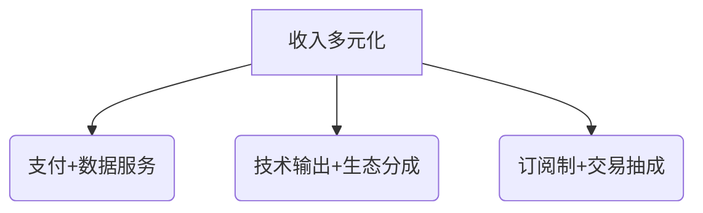

# 麦肯锡解读：全球金融科技发展与应用的八大趋势

## 趋势一：不同地区金融科技颠覆难度差异显著  
全球金融科技市场呈现明显的区域分化特征。中国通过宽松监管环境催生了蚂蚁金服等超级生态，而美国严格的监管体系则培育了分散型独角兽集群。欧盟的跨境监管互认机制（如单一护照制度）为初创企业节省了70%以上的合规成本，但美国各州独立的金融牌照要求却使跨境扩张成本增加3-5倍。  

**区域对比数据**  
| 地区       | 监管特点         | 创业公司生存率 | 典型案例       |
|------------|------------------|----------------|----------------|
| 中国       | 监管沙盒试点     | 42%            | 蚂蚁金服       |
| 美国       | 多级牌照制度     | 28%            | Robinhood      |
| 欧盟       | 单一护照制度     | 65%            | Klarna         |

👉 [深度解析全球金融科技监管差异](https://bit.ly/okx_welcome)  

**FAQ：中国金融科技企业出海面临哪些挑战？**  
中国企业在欧美市场需面对三重门槛：1）数据跨境流动限制；2）本地化合规成本；3）文化差异导致的用户习惯差异。建议优先布局东南亚新兴市场，其金融科技渗透率年均增长达18%。

## 趋势二：技术迭代优于颠覆性创新  
金融科技领域正在经历从"技术跃进"到"场景优化"的转变。信贷审批领域，传统征信数据（还款历史等）在成熟市场仍保持67%的准确率优势，而机器学习通过融合200+非传统数据维度（如消费行为、社交活跃度），将风险评估精度提升至89%。  

**技术应用对比**  
| 技术路径       | 实施周期 | ROI提升 | 典型应用          |
|----------------|----------|---------|-------------------|
| 传统建模       | 3-6月    | 基准    | 基础信用评分      |
| 机器学习       | 6-12月   | 15-20%  | 智能风控系统      |
| 全新AI架构     | 18-24月  | 30%+    | 动态授信引擎      |

👉 [获取最新AI金融应用白皮书](https://bit.ly/okx_welcome)  

**FAQ：如何平衡技术创新与业务落地？**  
建议采用"721"资源分配法则：70%资源用于现有系统优化，20%投入渐进式创新，10%布局前沿技术。PayPal通过持续迭代其反欺诈系统，使交易误拒率从3.2%降至0.7%，年节省成本超2亿美元。

## 趋势三：商业执行力决定技术落地成效  
Marcus by Goldman Sachs的案例验证了执行能力的重要性。该平台通过：  
1. 数字化获客渠道（转化率提升40%）  
2. 自动化风控流程（审批时效缩短至3分钟）  
3. 动态定价模型（资金成本降低18%）  
实现400万用户和80亿美元贷款规模的突破。  

**成功要素对比**  
| 要素         | 技术驱动型 | 执行驱动型 |
|--------------|------------|------------|
| 产品迭代周期 | 9-12月     | 2-3月      |
| 用户获取成本 | $120       | $75        |
| 盈利周期     | 3-5年      | 18-24月    |

👉 [解密金融科技独角兽增长密码](https://bit.ly/okx_welcome)  

**FAQ：传统机构如何提升执行效率？**  
建议建立"数字作战室"机制，整合产品、技术、运营团队，采用敏捷开发模式。摩根大通通过该模式将新产品上市时间从14个月压缩至5个月。

## 趋势四：资本聚焦可持续商业模式  
2023年全球金融科技融资呈现结构性调整：  
- 早期投资占比下降至35%（2021年为52%）  
- 盈利型公司估值溢价达4.2倍  
- 收入多元化企业融资成功率提升60%  

Ripple的XRP生态验证了替代融资路径：  
1. 通过跨境支付交易收取0.01%手续费  
2. 向合作银行提供技术授权  
3. 参与央行数字货币项目  

**融资策略建议**  


## 趋势五：用户体验升级进入产品深化阶段  
Robinhood的演进路径揭示行业规律：  
1.0阶段：零佣金交易（用户增长至1800万）  
2.0阶段：增值服务（Gold会员ARPU提升300%）  
3.0阶段：衍生品创新（期权交易量年增240%）  

**用户体验升级路线图**  
```stata
用户体验维度 | 基础需求 | 进阶需求 | 深度需求
--------------|---------|---------|---------
交易效率     | 秒级响应| 智能路由| 算法优化
产品多样性   | 基础标的| 结构化产品| 跨境服务
风险管理     | 基础提示| 实时预警| 自动对冲
```

## 趋势六：传统机构的数字化反击战  
瑞银SmartWealth的运营数据显示：  
- 智能投顾管理费降至0.3%（传统服务1.5%）  
- 客户留存率提升至82%  
- 资产配置效率提高40%  

ING的Fintech Village项目成果：  
1. 孵化周期缩短至6个月  
2. 合作项目商业化率73%  
3. 技术采纳成本降低55%  

## 趋势七：生态协同创造增量价值  
摩根士丹利与OnDeck的合作模式：  
- 风险评估模型共享（坏账率下降1.2%）  
- 渠道互补（OnDeck获客成本降低35%）  
- 数据联合建模（客户画像维度增加80%）  

**合作模式收益对比**  
| 合作类型   | 技术获取成本 | 市场渗透率提升 | 创新周期缩短 |
|------------|--------------|----------------|--------------|
| 战略投资   | $2-5M        | 15%            | 6-8月        |
| 联合开发   | $1-2M        | 22%            | 4-6月        |
| 生态共建   | $500K+       | 35%            | 2-3月        |

## 趋势八：基础设施赛道的长跑机遇  
核心银行系统（CBS）升级市场呈现三大特征：  
1. 更替周期：5-10年（传统系统平均服役18年）  
2. 投资规模：全球年均$200亿  
3. 竞争格局：前5厂商占据68%份额  

ING Ventures基金运作模式：  
- 单笔投资规模：$50万-$200万  
- 孵化周期：9-18个月  
- 退出回报率：3.2倍  

**基础设施投资关键指标**  
```python
def calculate_roi(initial_cost, annual_saving, horizon):
    return (annual_saving * horizon - initial_cost)/initial_cost

# 传统核心系统升级
print(calculate_roi(5000000, 1200000, 5))  # ROI 20%
# 云原生系统部署
print(calculate_roi(3000000, 1500000, 5))  # ROI 150%
```

## 未来展望与行动建议  
金融科技市场正经历三大结构性转变：  
1. 竞争焦点：从用户争夺转向生态构建  
2. 技术路径：从单点突破转向系统集成  
3. 监管模式：从被动应对转向主动引导  

**机构行动路线图**  
```stata
| 时间节点  | 战略重点                | 关键动作                  |
|-----------|-------------------------|---------------------------|
| 2024Q2    | 数字化基础建设          | 核心系统云迁移            |
| 2024Q3    | 生态伙伴拓展            | 建立5+战略合作伙伴关系    |
| 2024Q4    | 数据资产化              | 客户标签体系升级至3.0版   |
| 2025Q1    | 监管科技部署            | 实时合规监控系统上线      |
```